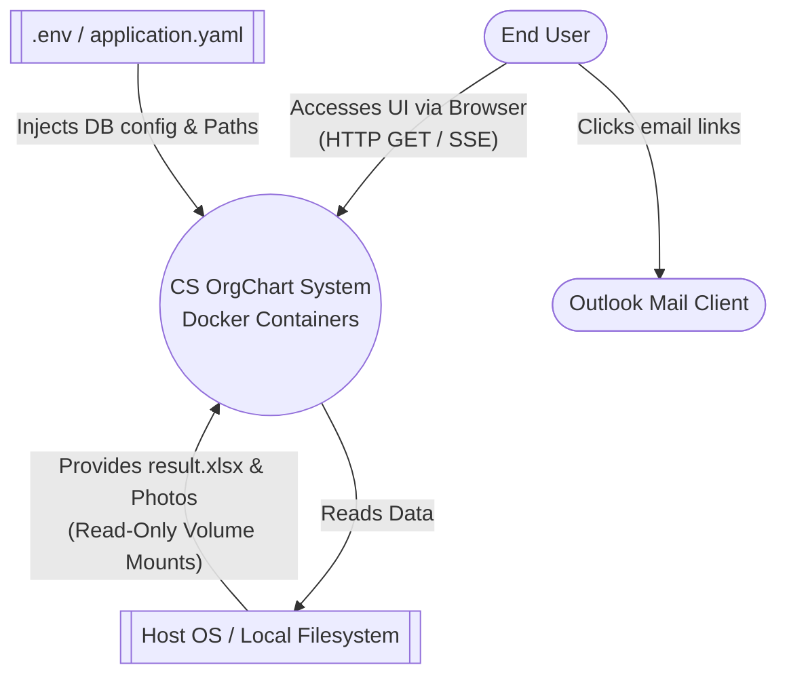
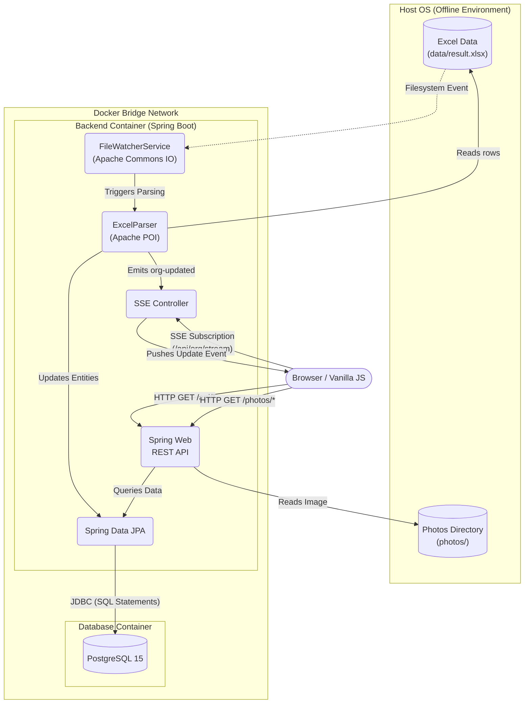

# Data Flow Diagrams (DFD): CS OrgChart

> [!NOTE]
> This document provides a deep technical analysis of the data flow within the CS OrgChart application, specifically focusing on its **hybrid offline architecture**. The system is designed to operate securely within a restricted enterprise network without requiring external internet access, relying on local file volumes and containerized services.

## 1. DFD Level 0: Context Diagram

The Context Diagram illustrates the macroscopic view of the CS OrgChart system, defining its boundaries and interactions with external entities: the End User, the Host Operating System (Filesystem), and Configuration Files.

> [!IMPORTANT]  
> **Security Measure: Read-Only Volume Mounts**  
> Notice that the interaction between the system and the Host OS is read-only for data and photos (`ro` flag in Docker Compose). This guarantees that the application cannot corrupt or maliciously alter the master Excel file or the employee portraits.

---

## 2. DFD Level 1: Process Breakdown

This diagram details the internal mechanics of the Dockerized environment, the data lifecycle from the offline Excel file to the database, and the real-time event streaming to the user's browser.

> [!WARNING]  
> **Security Measure: Network Isolation**  
> The PostgreSQL container is isolated within the internal Docker bridge network. It does not expose its port directly to the external host network by default unless explicitly bound. The Backend Container serves as the sole proxy and access layer to the database, protecting it from direct querying or injection attacks.

---

## 3. Data Flow Matrix

The following matrix documents every critical data flow path across the architecture, describing the payload, the underlying protocol, and the technological layer.

| Flow ID | Source Component | Destination Component | Data Payload / Description | Protocol / Tech | Port / Socket |
|---------|------------------|-----------------------|----------------------------|-----------------|---------------|
| **F01** | Host OS / Filesystem | Backend (FileWatcher) | File alteration events (modify, create) for `result.xlsx` | OS File I/O (`inotify` / polling) | N/A |
| **F02** | Host OS / Filesystem | Backend (ExcelParser) | Raw binary stream of the Excel `.xlsx` file | OS File I/O | N/A |
| **F03** | Backend (JPA) | Database (PostgreSQL) | SQL Queries (DDL/DML), structured employee records | JDBC / TCP | 5432 (Internal) |
| **F04** | Backend (SSE Controller) | Browser (Frontend) | `org-updated` signal, retry payloads | SSE / HTTP(S) | 8080 (Internal) / Host Port |
| **F05** | Browser (Frontend) | Backend (REST API) | Request for employee lists, search query strings | HTTP(S) | 8080 (Internal) / Host Port |
| **F06** | Backend (REST API) | Host OS / Filesystem | Binary data of employee `.jpg` photos | OS File I/O | N/A |
| **F07** | Browser (Frontend) | Outlook Client | Formatting and launching local mail application | OS Protocol (`mailto:`) | N/A |

> [!CAUTION]  
> **Data Consistency Handling**  
> Flow **F01** triggers the execution of **F02**, **F03**, and **F04** in rapid succession. To avoid dirty reads during the Database parsing and updating process (`F03`), the Backend must complete transaction commits before broadcasting the update event (`F04`) to the active clients.
