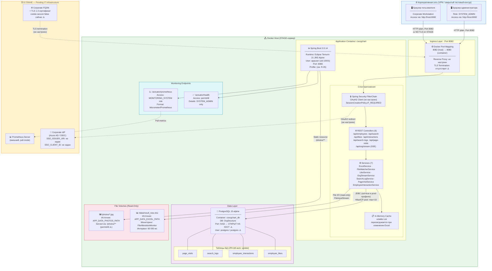
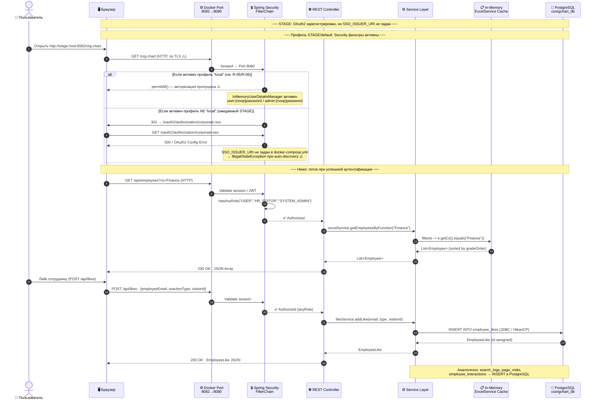
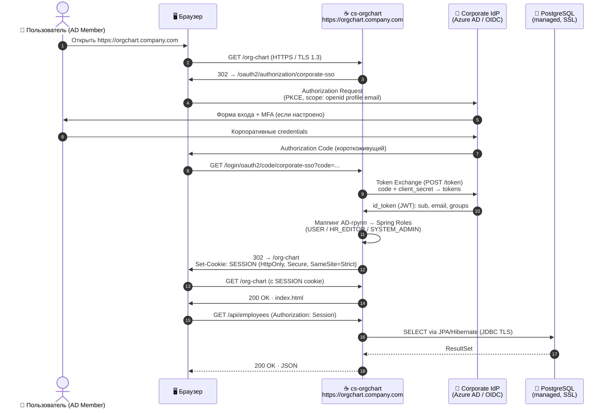
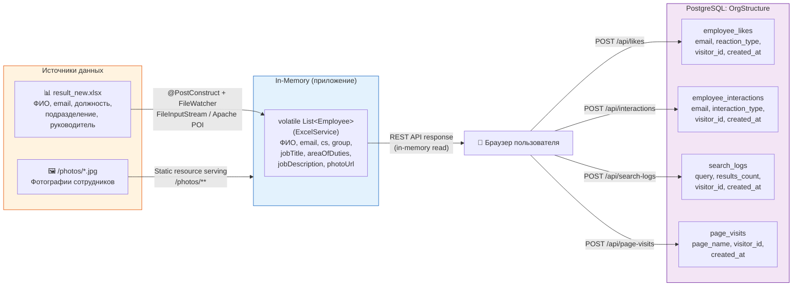

# Этап 1: Архитектура и Data Flow

> **Документ:** SAR-2026-001 · Часть 1/4
> **Проект:** CS OrgChart / OrgStructure · STAGE
> **Источники:** `pom.xml`, `docker-compose.yml`, `Dockerfile`, `application.yaml`, `application-local.yaml`

---

## 1.1 Архитектурная топология (C4 Container Diagram)

Диаграмма отражает реальную конфигурацию STAGE-среды на основе `docker-compose.yml` и `application.yaml`.



---

## 1.2 Техническая спецификация компонентов

Данные получены из `pom.xml` (Spring BOM 3.5.14), `docker-compose.yml` и `Dockerfile`.

### Уровень приложения

| Компонент | Артефакт | Версия | Порт | Источник |
|---|---|---|---|---|
| **Application Framework** | `spring-boot-starter-parent` | **3.5.14** | 8080 | `pom.xml:10` |
| **Web Layer** | `spring-boot-starter-web` (Embedded Tomcat) | BOM | 8080 | `pom.xml:50` |
| **Security** | `spring-boot-starter-security` | BOM | — | `pom.xml:34` |
| **OAuth2 Client** | `spring-boot-starter-oauth2-client` | BOM | — | `pom.xml:38` |
| **ORM** | `spring-boot-starter-data-jpa` + Hibernate | BOM | — | `pom.xml:56` |
| **Monitoring** | `spring-boot-starter-actuator` | BOM | 8080 | `pom.xml:28` |
| **Metrics Export** | `micrometer-registry-prometheus` | BOM | 8080 | `pom.xml:44` |
| **API Docs** | `springdoc-openapi-starter-webmvc-ui` | **2.5.0** | 8080 | `pom.xml:96` |
| **Excel Parser** | `poi-ooxml` (Apache POI) | **5.3.0** | — | `pom.xml:70` |
| **File Monitor** | `commons-io` (Apache Commons IO) | **2.16.1** | — | `pom.xml:76` |
| **Code Reduction** | `lombok` (compile-time only) | BOM | — | `pom.xml:82` |
| **Build Tool** | Apache Maven Wrapper | 3.9.6 | — | `Dockerfile:2` |
| **Language** | Java (Eclipse Temurin) | **21 LTS** | — | `pom.xml:21`, `Dockerfile:10` |

### Уровень инфраструктуры

| Компонент | Образ | Версия | Порт хоста | Порт контейнера | Источник |
|---|---|---|---|---|---|
| **Application Container** | `csorgchart:latest` (multi-stage build) | — | **8082** | 8080 | `docker-compose.yml:17,20` |
| **Database** | `postgres:15-alpine` | **15** | **5432** ⚠️ | 5432 | `docker-compose.yml:3,7` |
| **Build Base Image** | `maven:3.9.6-eclipse-temurin-21-alpine` | 3.9.6 | — | — | `Dockerfile:2` |
| **Runtime Base Image** | `eclipse-temurin:21-jre-alpine` | 21-jre | — | — | `Dockerfile:10` |

### Конфигурация соединения с БД

```yaml
# application.yaml (prod/stage profile)
spring:
  datasource:
    url: jdbc:postgresql://${DB_HOST:localhost}:${DB_PORT:5432}/${DB_NAME:OrgStructure}?ssl=true&sslmode=require
    username: ${DB_USER:postgres}      # fallback: postgres ⚠️
    password: ${DB_PASSWORD:postgres}  # fallback: postgres ⚠️
    hikari:
      maximum-pool-size: 10
      minimum-idle: 2

# application-local.yaml (профиль local)
spring:
  datasource:
    url: jdbc:postgresql://localhost:5432/OrgStructure?ssl=false  # SSL отключён ⚠️
```

### JVM-флаги контейнера (из `Dockerfile:27-31`)

```
java
  -XX:+UseContainerSupport          # Корректное определение ресурсов контейнера
  -XX:MaxRAMPercentage=75.0          # Ограничение heap до 75% от RAM контейнера
  -Djava.security.egd=file:/dev/./urandom  # Быстрая генерация случайных чисел
  -jar /app/app.jar
```

> Флаг `-agentlib:jdwp` (remote debug) **отсутствует** — корректная hardened-конфигурация.

---

## 1.3 Data Flow Diagram

### 1.3.1 Текущий поток на STAGE (профиль не `local`)



### 1.3.2 Целевой поток после внедрения Corporate SSO (PROD)



---

## 1.4 Классификация обрабатываемых данных

Классификация выполнена на основе полей модели `Employee.java`, JPA-сущностей и данных, хранимых в PostgreSQL.

### Матрица данных

| Категория | Поля / Атрибуты | Хранение | Классификация | Нормативная база |
|---|---|---|---|---|
| **ФИО сотрудника** | `Employee.name`, `Employee.pm` | Excel (файл), In-Memory Cache | 🔴 **Персональные данные** | GDPR Art.4, ЗРК «О персональных данных» |
| **Корпоративный e-mail** | `Employee.email`, `Employee.pmEmail`, `EmployeeLike.employeeEmail`, `EmployeeInteraction.employeeEmail` | Excel, In-Memory, PostgreSQL (3 таблицы) | 🔴 **Персональные данные** | GDPR Art.4 |
| **Должность и грейд** | `Employee.jobTitle`, `Employee.pmJobTitle`, `gradeOrder` (вычисляемый) | Excel, In-Memory | 🟡 **Internal Confidential** | Корпоративная политика |
| **Организационная структура** | `Employee.cs` (Central Services), `Employee.group` | Excel, In-Memory | 🟡 **Internal Confidential** | Корпоративная политика |
| **Зона ответственности** | `Employee.areaOfDuties`, `Employee.jobDescription` | Excel, In-Memory | 🟡 **Internal Confidential** | Корпоративная политика |
| **Фотографии сотрудников** | `/photos/{email}.jpg` | Файловая система (том `/photos`) | 🔴 **Биометрические / ПД** | GDPR Art.9, ЗРК |
| **Поведенческие данные** | `SearchLog.query`, `PageVisit.pageName`, `PageVisit.visitorId` | PostgreSQL | 🟡 **Internal Confidential** | Корпоративная политика |
| **Аналитика взаимодействий** | `EmployeeInteraction.interactionType` (PROFILE_VIEW, MAIL_CLICK), `visitorId` | PostgreSQL | 🟡 **Internal Confidential** | Корпоративная политика |
| **Реакции (лайки)** | `EmployeeLike.reactionType` (SOLVED, EXCEEDED), агрегированные счётчики | PostgreSQL | 🟢 **Internal** | — |
| **Учётные записи (STAGE-only)** | `user/password`, `admin/password` ({noop}) | InMemoryUserDetailsManager | 🔴 **Критические** — временные, не для PROD | Политика управления доступом |

### Схема хранения данных по компонентам



> **Важно:** Данные из Excel (`result_new.xlsx`) хранятся **исключительно в оперативной памяти** приложения и не записываются в PostgreSQL. В БД хранится только поведенческая аналитика. Основной источник ПД сотрудников — Excel-файл на файловой системе хоста (том `/data`).

---

*← [README.md](README.md) | → [02_application_security_and_code.md](02_application_security_and_code.md)*

*SAR-2026-001 · Часть 1/4 · CS OrgChart · STAGE*
