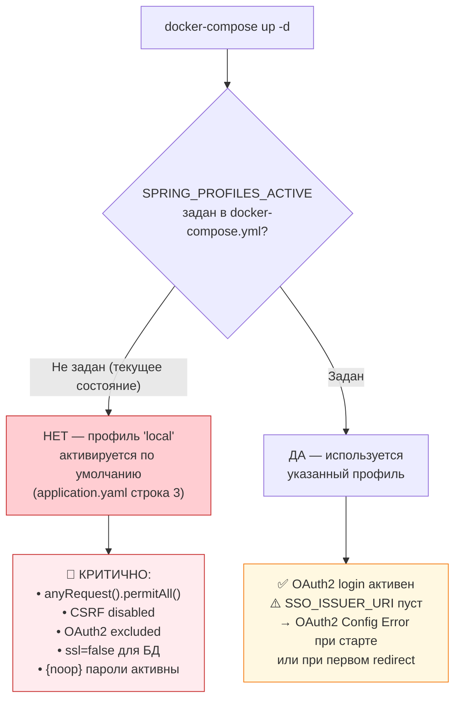

# Этап 2: Безопасность приложения и аудит кода

> **Документ:** SAR-2026-001 · Часть 2/4
> **Проект:** CS OrgChart / OrgStructure · STAGE
> **Источники:** `SecurityConfig.java`, `WebMvcConfig.java`, `application.yaml`, `application-local.yaml`,
> все 6 контроллеров: `EmployeeController.java`, `EmployeeInteractionController.java`, `LikeController.java`,
> `OrgStreamController.java`, `PageVisitController.java`, `SearchLogController.java`

---

## 2.1 Критическая проблема: конфигурация профилей Spring Boot

### 2.1.1 Анализ файлов конфигурации

**Файл:** `src/main/resources/application.yaml` (строка 3)

```yaml
spring:
  profiles:
    active: local   # ⚠️ КРИТИЧНО: профиль "local" активен по умолчанию
```

**Файл:** `src/main/resources/application-local.yaml`

```yaml
spring:
  autoconfigure:
    exclude: org.springframework.boot.autoconfigure.security.oauth2.client.OAuth2ClientAutoConfiguration
    # ⚠️ OAuth2 Client полностью исключён из автоконфигурации
  datasource:
    url: jdbc:postgresql://localhost:5432/OrgStructure?ssl=false   # ⚠️ SSL отключён
    username: postgres
    password: postgres
server:
  servlet:
    session:
      cookie:
        secure: false      # ⚠️ HTTPS-куки не требуются
        same-site: lax     # ⚠️ Ослаблен CSRF-контроль через куки
```

### 2.1.2 Поведение SecurityConfig при профиле `local`

**Файл:** `src/main/java/cs_orgchart/config/SecurityConfig.java`

```java
@Bean
public SecurityFilterChain filterChain(HttpSecurity http) throws Exception {
    boolean isLocal = Arrays.asList(env.getActiveProfiles()).contains("local");  // строка 30

    // ... настройка заголовков ...

    if (isLocal) {
        // ⚠️ СТРОКИ 48-51: полное отключение авторизации и CSRF
        http.authorizeHttpRequests(auth -> auth.anyRequest().permitAll())
            .csrf(csrf -> csrf.disable());
    } else {
        // Строки 52-68: OAuth2 + RBAC для PROD/STAGE
        http.authorizeHttpRequests(auth -> auth
            .requestMatchers("/actuator/health").permitAll()
            .requestMatchers("/actuator/prometheus").hasRole("MONITORING_SYSTEM")
            // ...
        );
        http.oauth2Login(oauth2 -> oauth2.defaultSuccessUrl("/org-chart", true));
    }
    return http.build();
}

@Bean
@Profile("local")  // строка 75: активен только при профиле "local"
public InMemoryUserDetailsManager userDetailsService() {
    UserDetails user = User.withUsername("user")
        .password("{noop}password")   // ⚠️ {noop} = пароль в открытом виде, без хэша
        .roles("USER")
        .build();
    UserDetails admin = User.withUsername("admin")
        .password("{noop}password")   // ⚠️ {noop} = пароль в открытом виде, без хэша
        .roles("SYSTEM_ADMIN", "USER", "HR_EDITOR")
        .build();
    return new InMemoryUserDetailsManager(user, admin);
}
```

### 2.1.3 Матрица состояний безопасности по профилям

| Параметр безопасности | Профиль `local` | Профиль НЕ `local` (STAGE/PROD) |
|---|---|---|
| **Авторизация** | ❌ `anyRequest().permitAll()` — отключена | ✅ RBAC по ролям активен |
| **CSRF-защита** | ❌ `csrf.disable()` — отключена полностью | ✅ Включена (кроме `/actuator/**`) |
| **OAuth2 / SSO** | ❌ Исключён через `autoconfigure.exclude` | ⚠️ Настроен, но SSO_ISSUER_URI пуст |
| **Учётные записи** | ⚠️ InMemoryUserDetailsManager ({noop}password) | ✅ Только через SSO (IdP) |
| **SSL для БД** | ❌ `ssl=false` в JDBC URL | ✅ `ssl=true&sslmode=require` |
| **Cookie Secure** | ❌ `secure: false` | ⚠️ `secure: false` (до подключения TLS) |
| **Cookie SameSite** | ⚠️ `lax` (ослаблено) | ✅ `strict` |

### 2.1.4 Сценарий риска: деплой в Docker без явного профиля



> **Вывод для ISS:** В `docker-compose.yml` отсутствует переменная `SPRING_PROFILES_ACTIVE`. При текущей конфигурации Docker-деплой активирует профиль `local`, что полностью отключает все механизмы безопасности.
>
> **Немедленное исправление:** добавить в `docker-compose.yml` в секцию `environment` контейнера `csorgchart`:
> ```yaml
> - SPRING_PROFILES_ACTIVE=stage
> ```

---

## 2.2 Анализ REST-контроллеров: уязвимость `@CrossOrigin`

### 2.2.1 Реестр контроллеров с CORS-конфигурацией

| Контроллер | Файл | Строка | `@CrossOrigin` | Эндпоинты |
|---|---|---|---|---|
| `EmployeeController` | `EmployeeController.java` | **строка 16** | `@CrossOrigin(origins = "*")` ⚠️ | `GET /api/functions`, `GET /api/search`, `GET /api/employees` |
| `EmployeeInteractionController` | `EmployeeInteractionController.java` | **строка 15** | `@CrossOrigin(origins = "*")` ⚠️ | `POST /api/interactions` |
| `LikeController` | `LikeController.java` | **строка 17** | `@CrossOrigin(origins = "*")` ⚠️ | `POST /api/likes`, `GET /api/likes/summary`, `GET /api/likes/summary/{email}` |
| `PageVisitController` | `PageVisitController.java` | **строка 15** | `@CrossOrigin(origins = "*")` ⚠️ | `POST /api/page-visits` |
| `SearchLogController` | `SearchLogController.java` | **строка 15** | `@CrossOrigin(origins = "*")` ⚠️ | `POST /api/search-logs` |
| `OrgStreamController` | `OrgStreamController.java` | *(отсутствует)* | Не задан (CORS по умолчанию) | `GET /api/org/stream` (SSE) |

### 2.2.2 Анализ риска `@CrossOrigin(origins = "*")`

**Проблема:** Аннотация `@CrossOrigin(origins = "*")` разрешает запросы с **любого origin**, включая внешние домены. Это создаёт риск Cross-Origin Resource Sharing (CORS) атак:

- Злоумышленник может разместить страницу на внешнем домене, которая выполнит запросы к API от имени аутентифицированного пользователя.
- Для POST-эндпоинтов (`/api/likes`, `/api/interactions`, `/api/search-logs`, `/api/page-visits`) это позволяет записывать произвольные данные в БД.
- Для GET `/api/employees`, `/api/search` — утечка персональных данных сотрудников через cross-origin запросы.

**На STAGE** риск частично митигируется закрытым сетевым контуром.

**Исправление для PROD:**

```java
// Заменить во всех контроллерах:
@CrossOrigin(origins = "*")  // ⚠️ Небезопасно

// На явный список разрешённых origins:
@CrossOrigin(origins = "${app.cors.allowed-origins:https://orgchart.company.com}")
```

---

## 2.3 Незащищённый эндпоинт `/photos/**`

### 2.3.1 Конфигурация в SecurityConfig.java (строка 58)

```java
// src/main/java/cs_orgchart/config/SecurityConfig.java, строки 54-62
http.authorizeHttpRequests(auth -> auth
    .requestMatchers("/actuator/health").permitAll()
    .requestMatchers("/actuator/prometheus").hasRole("MONITORING_SYSTEM")
    .requestMatchers("/actuator/**").denyAll()
    .requestMatchers("/css/**", "/js/**", "/images/**", "/photos/**").permitAll()  // ⚠️ СТРОКА 58
    .requestMatchers("/api/admin/upload-excel").hasAnyRole("HR_EDITOR", "SYSTEM_ADMIN")
    .requestMatchers("/api/admin/**").hasRole("SYSTEM_ADMIN")
    .requestMatchers("/api/structure/**", "/org-chart/**", "/org-chart").hasAnyRole("USER", ...)
    .anyRequest().authenticated()
);
```

### 2.3.2 Конфигурация в WebMvcConfig.java

```java
// src/main/java/cs_orgchart/config/WebMvcConfig.java, строки 30-38
String location = path.startsWith("file:") ? path : "file:///" + path.replaceFirst("^/+", "");

registry.addResourceHandler("/photos/**")
        .addResourceLocations(location)   // монтирует реальную ФС: /photos/*.jpg
        .setCacheControl(NO_CACHE);
```

### 2.3.3 Риск

Фотографии сотрудников — **биометрические персональные данные** (GDPR Art. 9). Маршрут `/photos/**` явно разрешён без аутентификации (`permitAll()`), что означает:
- Любой пользователь в сети, знающий email сотрудника, может получить его фотографию без входа в систему
- URL фотографий предсказуемы: `/photos/{email}.jpg` (или `/photos/{username}.jpg`)
- Возможно перечисление фотографий всех сотрудников без авторизации

**Исправление:**
```java
// Убрать /photos/** из permitAll, добавить авторизацию:
.requestMatchers("/css/**", "/js/**", "/images/**").permitAll()
// /photos/** — убрать из списка; доступ по anyRequest().authenticated() или явно:
.requestMatchers("/photos/**").hasAnyRole("USER", "HR_EDITOR", "SYSTEM_ADMIN")
```

---

## 2.4 RBAC-матрица доступа

Роли определены в `SecurityConfig.java` (строки 56–62, 77–85). Маппинг AD-групп → Spring Roles будет выполнен при подключении SSO.

### 2.4.1 Определение ролей

| Роль Spring | Источник на STAGE | Источник на PROD (целевой) | Описание |
|---|---|---|---|
| `ROLE_USER` | `InMemoryUserDetailsManager` (`user`) | AD-группа → `corporate-sso` claim | Стандартный пользователь CS |
| `ROLE_HR_EDITOR` | `InMemoryUserDetailsManager` (`admin`) | AD-группа → `corporate-sso` claim | Кадровый редактор (загрузка Excel) |
| `ROLE_SYSTEM_ADMIN` | `InMemoryUserDetailsManager` (`admin`) | AD-группа → `corporate-sso` claim | Системный администратор |
| `ROLE_MONITORING_SYSTEM` | Не определена в InMemory | Сервисный аккаунт / API-ключ | Prometheus-скрапер |

### 2.4.2 Матрица прав по эндпоинтам

| Эндпоинт | HTTP | `USER` | `HR_EDITOR` | `SYSTEM_ADMIN` | `MONITORING` | Анонимно |
|---|:---:|:---:|:---:|:---:|:---:|:---:|
| `GET /org-chart` | GET | ✅ | ✅ | ✅ | ❌ | ❌ |
| `GET /api/employees` | GET | ✅ | ✅ | ✅ | ❌ | ❌ |
| `GET /api/employees?cs=*` | GET | ✅ | ✅ | ✅ | ❌ | ❌ |
| `GET /api/functions` | GET | ✅ | ✅ | ✅ | ❌ | ❌ |
| `GET /api/search?q=*` | GET | ✅ | ✅ | ✅ | ❌ | ❌ |
| `GET /api/org/stream` (SSE) | GET | ✅ | ✅ | ✅ | ❌ | ❌ |
| `POST /api/likes` | POST | ✅ | ✅ | ✅ | ❌ | ❌ |
| `GET /api/likes/summary` | GET | ✅ | ✅ | ✅ | ❌ | ❌ |
| `GET /api/likes/summary/{email}` | GET | ✅ | ✅ | ✅ | ❌ | ❌ |
| `POST /api/interactions` | POST | ✅ | ✅ | ✅ | ❌ | ❌ |
| `POST /api/page-visits` | POST | ✅ | ✅ | ✅ | ❌ | ❌ |
| `POST /api/search-logs` | POST | ✅ | ✅ | ✅ | ❌ | ❌ |
| `POST /api/admin/upload-excel` | POST | ❌ | ✅ | ✅ | ❌ | ❌ |
| `ANY /api/admin/**` | ANY | ❌ | ❌ | ✅ | ❌ | ❌ |
| `GET /actuator/health` | GET | ✅* | ✅* | ✅ (details) | ✅ | ✅ ⚠️ |
| `GET /actuator/prometheus` | GET | ❌ | ❌ | ❌ | ✅ | ❌ |
| `ANY /actuator/**` (прочее) | ANY | ❌ | ❌ | ❌ | ❌ | ❌ |
| `GET /photos/**` | GET | ✅ | ✅ | ✅ | ✅ | ✅ ⚠️ |
| `GET /css/**, /js/**` | GET | ✅ | ✅ | ✅ | ✅ | ✅ |

*`show-details: when_authorized` — детали health доступны только `SYSTEM_ADMIN`.

### 2.4.3 Настройки HTTP Security Headers

Из `SecurityConfig.java` (строки 34–42):

| Заголовок | Значение | Оценка |
|---|---|---|
| `X-Content-Type-Options` | `nosniff` | ✅ Корректно |
| `X-Frame-Options` | `DENY` | ✅ Корректно (защита от clickjacking) |
| `X-XSS-Protection` | Стандартный Spring | ✅ Настроен |
| `Referrer-Policy` | `strict-origin-when-cross-origin` | ✅ Корректно |
| `Content-Security-Policy` | `default-src 'self'; script-src 'self' 'unsafe-inline'; style-src 'self' 'unsafe-inline'; img-src 'self' data:;` | ⚠️ `unsafe-inline` снижает защиту от XSS |
| `Strict-Transport-Security` | ❌ Не настроен | 🔴 Добавить после подключения TLS |
| `Cache-Control` (HTML) | `no-store, no-cache, must-revalidate` | ✅ Настроен в `WebMvcConfig.java` |

---

## 2.5 Политика DevSecOps-сканирования кода

> **Текущее состояние:** `.gitlab-ci.yml` в репозитории **отсутствует**. Все указанные ниже инструменты — целевая конфигурация, которую необходимо внедрить.

### 2.5.1 SAST — Static Application Security Testing

#### SonarQube

```yaml
# .gitlab-ci.yml — целевой pipeline stage
sonar-scan:
  stage: security-scan
  image: maven:3.9.6-eclipse-temurin-21-alpine
  script:
    - mvn sonar:sonar
        -Dsonar.host.url=${SONAR_HOST_URL}
        -Dsonar.login=${SONAR_TOKEN}
        -Dsonar.projectKey=cs-orgchart
        -Dsonar.qualitygate.wait=true
  rules:
    - if: '$CI_PIPELINE_SOURCE == "merge_request_event"'
    - if: '$CI_COMMIT_BRANCH == "stage"'
```

**Приоритетные проверки SonarQube для данного проекта:**

| Правило | Описание | Затронутые файлы |
|---|---|---|
| `java:S5131` | XSS через параметры запроса | `EmployeeController.java` (`q` param в логе) |
| `java:S2068` | Hardcoded credentials | `application.yaml` (fallback `postgres`) |
| `java:S5247` | Отключение CSRF | `SecurityConfig.java:51` (профиль local) |
| `java:S5804` | CORS wildcard | Все 5 контроллеров с `@CrossOrigin(origins="*")` |
| `java:S2755` | XXE в XML/OOXML парсере | `ExcelService.java` (Apache POI) |

#### GitLab SAST (встроенный)

```yaml
include:
  - template: Security/SAST.gitlab-ci.yml

variables:
  SAST_JAVA_VERSION: 21
  SAST_EXCLUDED_PATHS: "target/, src/test/"
```

### 2.5.2 SCA — Software Composition Analysis

**Приоритетные библиотеки для проверки CVE:**

| Библиотека | Версия | Причина приоритета |
|---|---|---|
| `apache poi-ooxml` | 5.3.0 | Исторические CVE на XXE в OOXML-парсере (CVE-2014-3574 и аналоги) |
| `commons-io` | 2.16.1 | Операции с файловой системой, path traversal |
| `springdoc-openapi` | 2.5.0 | Swagger UI доступен в non-prod окружении |
| `spring-boot-starter-security` | BOM 3.5.14 | Проверка Security CVE нового релиза |

```yaml
# OWASP Dependency-Check
dependency-check:
  stage: security-scan
  image: maven:3.9.6-eclipse-temurin-21-alpine
  script:
    - mvn org.owasp:dependency-check-maven:check
        -DfailBuildOnCVSS=7
        -DsuppressionFile=dependency-check-suppressions.xml
  artifacts:
    paths:
      - target/dependency-check-report.html
    reports:
      dependency_scanning: target/dependency-check-report.json
```

### 2.5.3 Secret Detection — Gitleaks

```yaml
# Gitleaks: проверка всей истории коммитов
gitleaks:
  stage: validate
  image: zricethezav/gitleaks:latest
  script:
    - gitleaks detect
        --source .
        --config .gitleaks.toml
        --report-format sarif
        --report-path gitleaks-report.sarif
        --exit-code 1
  artifacts:
    paths:
      - gitleaks-report.sarif
```

**Файл `.gitleaks.toml` (минимальная конфигурация для проекта):**

```toml
[allowlist]
  description = "Global allowlist"
  regexes = [
    # Игнорировать placeholder-значения в application.yaml
    '''\$\{[A-Z_]+:[^}]+\}''',
  ]
  paths = [
    "src/test/**",
    "target/**"
  ]
```

**Текущие риски обнаружения секретов:**
- `application.yaml`: fallback-значения `postgres` в `${DB_PASSWORD:postgres}` — технически не секрет (placeholder), но требует проверки истории коммитов на случай commit'а реальных паролей
- `docker-compose.yml`: строка 11 — `POSTGRES_PASSWORD=postgres` в открытом виде — **будет обнаружен Gitleaks**

---

*← [01_architecture_and_dataflow.md](01_architecture_and_dataflow.md) | → [03_infrastructure_and_devsecops.md](03_infrastructure_and_devsecops.md)*

*SAR-2026-001 · Часть 2/4 · CS OrgChart · STAGE*
