# Этап 3: Инфраструктура и защита данных

> **Документ:** SAR-2026-001 · Часть 3/4
> **Проект:** CS OrgChart / OrgStructure · STAGE
> **Источники:** `docker-compose.yml`, `Dockerfile`, `application.yaml`, `logback-spring.xml`

---

## 3.1 Аудит `docker-compose.yml`

### 3.1.1 Полный текст с аннотациями безопасности

```yaml
# docker-compose.yml — аудит безопасности
services:
  db:
    image: postgres:15-alpine
    container_name: csorgchart_db
    restart: unless-stopped
    ports:
      - "5432:5432"   # ⚠️ СТРОКА 7: КРИТИЧНО — порт PostgreSQL открыт на хост
                      #    Любой хост в сети может подключиться к БД напрямую
    environment:
      - POSTGRES_DB=OrgStructure
      - POSTGRES_USER=postgres           # ⚠️ Стандартный суперпользователь PostgreSQL
      - POSTGRES_PASSWORD=postgres       # ⚠️ СТРОКА 11: КРИТИЧНО — пароль в открытом виде
    volumes:
      - ./pgdata:/var/lib/postgresql/data  # ⚠️ Том без шифрования на ФС хоста

  csorgchart:
    container_name: csorgchart
    image: csorgchart:latest
    restart: unless-stopped
    ports:
      - "${APP_PORT:-8082}:8080"         # ℹ️ Гибкий порт через ENV, дефолт 8082
    volumes:
      - ./data:/data:ro                  # ✅ Read-Only том для Excel
      - ./photos:/photos:ro              # ✅ Read-Only том для фотографий
    environment:
      - APP_DATA_EXCEL_PATH=/data/result_new.xlsx
      - APP_DATA_PHOTOS_PATH=/photos
      - APP_DATA_WATCH_INTERVAL_MS=60000
      - SPRING_DATASOURCE_URL=jdbc:postgresql://db:5432/OrgStructure
                                         # ⚠️ Нет ?ssl=true&sslmode=require для STAGE
      - SPRING_DATASOURCE_USERNAME=postgres  # ⚠️ Совпадает с суперпользователем
      - SPRING_DATASOURCE_PASSWORD=postgres  # ⚠️ Пароль в открытом виде
                                         # ❌ SPRING_PROFILES_ACTIVE не задан → active: local
    depends_on:
      - db
```

### 3.1.2 Матрица проблем и исправлений docker-compose.yml

| # | Проблема | Строка | Серьёзность | Исправление |
|---|---|---|---|---|
| **DC-01** | `ports: "5432:5432"` — PostgreSQL открыт на хост | 7 | 🔴 Критично | Убрать проброс порта; оставить только внутреннюю Docker network |
| **DC-02** | `POSTGRES_PASSWORD=postgres` в открытом виде | 11 | 🔴 Критично | Docker Secrets / `.env`-файл вне репозитория / Vault |
| **DC-03** | `POSTGRES_USER=postgres` — суперпользователь | 10 | 🟠 High | Создать отдельного пользователя с минимальными привилегиями |
| **DC-04** | `SPRING_PROFILES_ACTIVE` не задан | — | 🔴 Критично | Добавить `- SPRING_PROFILES_ACTIVE=stage` |
| **DC-05** | JDBC URL без `?ssl=true&sslmode=require` | 28 | 🟠 High | Добавить SSL-параметры в SPRING_DATASOURCE_URL |
| **DC-06** | `SPRING_DATASOURCE_PASSWORD=postgres` в открытом виде | 30 | 🔴 Критично | Вынести в Docker Secrets / ENV из CI/CD |
| **DC-07** | Том `./pgdata` без шифрования | 13 | 🟡 Medium | OS-level шифрование (LUKS) на хосте |
| **DC-08** | Отсутствует `networks:` секция | — | 🟡 Medium | Явная сетевая изоляция между контейнерами |

### 3.1.3 Целевая конфигурация docker-compose.yml (PROD)

```yaml
# docker-compose.yml — целевая PROD-конфигурация
version: "3.9"

services:
  db:
    image: postgres:15-alpine
    container_name: csorgchart_db
    restart: unless-stopped
    # ✅ Порт 5432 НЕ пробрасывается на хост — только внутренняя сеть
    environment:
      - POSTGRES_DB=OrgStructure
      - POSTGRES_USER=${DB_USER}           # ✅ Из Docker Secret / ENV
      - POSTGRES_PASSWORD=${DB_PASSWORD}   # ✅ Из Docker Secret / ENV
    volumes:
      - pgdata:/var/lib/postgresql/data    # ✅ Named volume + LUKS на хосте
    networks:
      - backend                            # ✅ Изолированная сеть

  csorgchart:
    container_name: csorgchart
    image: csorgchart:latest
    restart: unless-stopped
    ports:
      - "8082:8080"
    volumes:
      - ./data:/data:ro
      - ./photos:/photos:ro
    environment:
      - SPRING_PROFILES_ACTIVE=stage       # ✅ Явный профиль
      - SPRING_DATASOURCE_URL=jdbc:postgresql://db:5432/OrgStructure?ssl=true&sslmode=require
      - SPRING_DATASOURCE_USERNAME=${DB_USER}
      - SPRING_DATASOURCE_PASSWORD=${DB_PASSWORD}
      - SSO_CLIENT_ID=${SSO_CLIENT_ID}     # ✅ Из CI/CD secrets
      - SSO_CLIENT_SECRET=${SSO_CLIENT_SECRET}
      - SSO_ISSUER_URI=${SSO_ISSUER_URI}
    depends_on:
      - db
    networks:
      - frontend
      - backend

volumes:
  pgdata:
    driver: local

networks:
  frontend:
  backend:
    internal: true                         # ✅ Внутренняя сеть без выхода наружу
```

---

## 3.2 Политика шифрования

### 3.2.1 Encryption in Transit

```mermaid
graph TB
    subgraph CURRENT["Текущее состояние STAGE"]
        CL1["👤 Клиент"] -->|"HTTP plain\n⚠️ НЕТ TLS"| APP1["☕ App :8082"]
        APP1 -->|"JDBC plain\n(ssl=false в docker-compose)\n⚠️ НЕТ TLS"| DB1["🐘 PostgreSQL"]
    end

    subgraph TARGET["Целевое состояние PROD"]
        CL2["👤 Клиент"] -->|"HTTPS / TLS 1.3\nHSTS enabled"| NX["🔀 Reverse Proxy\n(Nginx / Traefik)"]
        NX -->|"HTTP internal\n(внутри Docker network)"| APP2["☕ App :8080"]
        APP2 -->|"JDBC + TLS\n?ssl=true&sslmode=require\nserver cert validation"| DB2["🐘 PostgreSQL\n(SSL enabled)"]
    end

    style CURRENT fill:#ffebee,stroke:#c62828,color:#0f172a,stroke-width:2px,font-weight:bold
    style TARGET fill:#e8f5e9,stroke:#2e7d32,color:#0f172a,stroke-width:2px,font-weight:bold
```



| Канал | STAGE (текущее) | PROD (целевое) | Источник конфигурации |
|---|---|---|---|
| **Клиент → Приложение** | HTTP (plain) ⚠️ | HTTPS / TLS 1.3 | Pending IT Infra |
| **App → PostgreSQL** | JDBC plain (`ssl=false` в docker-compose) ⚠️ | JDBC SSL (`sslmode=verify-full`) | `application.yaml:7`, `docker-compose.yml:28` |
| **Внутри Docker network** | Docker bridge (plain) | Принять риск (internal network) | `docker-compose.yml` |
| **Session Cookie** | `secure: false` ⚠️, `httpOnly: true`, `sameSite: strict` | `secure: true`, `httpOnly: true`, `sameSite: strict` | `application.yaml:42` |
| **Actuator → Prometheus** | HTTP (internal) | mTLS для сервисных аккаунтов | — |

**Требования к TLS для PROD:**
- Минимальная версия: **TLS 1.2** (рекомендуется TLS 1.3)
- Запрещены: SSLv3, TLS 1.0, TLS 1.1
- Cipher suites: ECDHE-based (Forward Secrecy)
- Certificate: выдан корпоративным CA или Let's Encrypt (через IT Infrastructure)

### 3.2.2 Encryption at Rest

| Компонент | Текущее состояние | Рекомендации для PROD |
|---|---|---|
| **PostgreSQL данные** | Том `./pgdata` — нет шифрования на уровне ФС | OS-level: LUKS2 (Linux), BitLocker (Windows) или PostgreSQL TDE (расширение `pg_tde`) |
| **Excel-файл** | Том `./data` (read-only) — нет шифрования | Ограничить ACL на хосте; рассмотреть шифрование самого файла |
| **Фотографии** | Том `./photos` (read-only) — нет шифрования | Аналогично Excel; фото — биометрические ПД (GDPR Art.9) |
| **Резервные копии** | Не определены | `pg_dump` + AES-256 (`openssl enc -aes-256-cbc`) + хранение в защищённом хранилище |
| **JAR-файл** | `chmod 500`, `appuser:appgroup` (uid 10001) | ✅ Достаточно для контейнерной среды |
| **Секреты (ENV)** | В docker-compose.yml в открытом виде ⚠️ | Docker Secrets / HashiCorp Vault / GitLab CI/CD Secrets |

---

## 3.3 CI/CD Pipeline — GitLab CI с Security Gates

> **Текущее состояние:** Полноценный файл `.gitlab-ci.yml` **уже добавлен** и настроен в корне репозитория.

```mermaid
flowchart LR
    TRIGGER["Push / MR"]
    TEST["Test & Linter\n(JUnit, JaCoCo, Cache)"]
    SEC["Security Scan\n(SAST, Secret Detection, SCA)"]
    BUILD["Docker Build & Registry\n(mvn package, dind)"]
    DEPLOY["Deploy to Stage\n(SSH, Docker Compose)"]
    HEALTH["Health Check\n(/actuator/health)"]

    TRIGGER --> TEST
    TEST --> SEC
    SEC --> BUILD
    BUILD --> DEPLOY
    DEPLOY --> HEALTH

    style TEST fill:#e3f2fd,stroke:#1565c0,color:#0f172a,stroke-width:2px,font-weight:bold
    style SEC fill:#fce4ec,stroke:#c62828,color:#0f172a,stroke-width:2px,font-weight:bold
    style BUILD fill:#e8f5e9,stroke:#2e7d32,color:#0f172a,stroke-width:2px,font-weight:bold
    style DEPLOY fill:#fff8e1,stroke:#f57f17,color:#0f172a,stroke-width:2px,font-weight:bold
    style HEALTH fill:#e0f7fa,stroke:#006064,color:#0f172a,stroke-width:2px,font-weight:bold
```



### 3.3.1 Security Gates — критерии блокировки

| Gate | Инструмент | Критерий FAIL (блокирует pipeline) |
|---|---|---|
| **Secret Detection** | Gitleaks | Любой обнаруженный секрет → exit code 1 |
| **SAST** | GitLab SAST + SonarQube | Quality Gate: любой Critical Security Hotspot |
| **SCA** | OWASP Dependency-Check | Любая CVE с CVSS Score ≥ 7.0 без явного исключения |
| **Image Scan** | Trivy | Любая Critical CVE; High CVE > допустимого порога |
| **Unit Tests** | JUnit 5 | Любой failed test; Coverage < 70% |
| **Smoke Test** | curl/wget | `/actuator/health` возвращает не `{"status":"UP"}` |

### 3.3.2 Управление секретами в GitLab CI

```yaml
# .gitlab-ci.yml — переменные, хранимые в GitLab CI/CD Settings → Variables
variables:
  # Тип: Masked + Protected (не отображаются в логах)
  DB_PASSWORD: $DB_PASSWORD_SECRET        # GitLab masked variable
  SSO_CLIENT_SECRET: $SSO_CLIENT_SECRET   # GitLab masked variable
  SSO_CLIENT_ID: $SSO_CLIENT_ID           # GitLab masked variable
  SSO_ISSUER_URI: $SSO_ISSUER_URI         # GitLab masked variable
  SONAR_TOKEN: $SONAR_TOKEN               # GitLab masked variable
```

---

## 3.4 Мониторинг, Observability и логирование безопасности

### 3.4.1 Текущая конфигурация логирования

**Файл:** `src/main/resources/logback-spring.xml`

```xml
<configuration>
    <appender name="CONSOLE" class="ch.qos.logback.core.ConsoleAppender">
        <encoder>
            <!-- Текущий формат: plain text, только STDOUT -->
            <pattern>%d{yyyy-MM-dd HH:mm:ss.SSS} [%thread] %-5level %logger{36} - %msg%n</pattern>
        </encoder>
    </appender>

    <logger name="org.springframework.security" level="INFO" />
    <logger name="cs_orgchart" level="DEBUG" />  <!-- ⚠️ DEBUG на STAGE — избыточно -->

    <root level="INFO">
        <appender-ref ref="CONSOLE" />
    </root>
</configuration>
```

**Проблемы текущей конфигурации:**
1. **Только STDOUT** — логи доступны через `docker logs`, нет централизованного сбора
2. **Уровень DEBUG** для `cs_orgchart` на STAGE — в debug-логах могут появиться чувствительные данные
3. **Plain text формат** — затрудняет парсинг в SIEM
4. **Нет файлового appender** — при перезапуске контейнера логи теряются
5. **Нет маскирования PII** — email и поисковые запросы попадают в лог как есть

### 3.4.2 Аудит событий безопасности

| Событие | Текущее логирование | Файл | Проблема |
|---|---|---|---|
| `GET /api/search?q={query}` | `log.info("GET /api/search?q={}", q)` | `EmployeeController.java:31` | ⚠️ Query с ФИО попадает в лог |
| `POST /api/likes email={}, visitor={}` | `log.info("POST /api/likes email={} ...", email, ...)` | `LikeController.java:31` | ⚠️ Email сотрудника в логе |
| Excel reload | `log.info("Loaded {} employees ...", count)` | `ExcelService.java:61` | ✅ Безопасно |
| File changed | `log.info("{} changed (file: {}), ...")` | `FileWatcherService.java:131` | ✅ Безопасно |
| Spring Security events | `org.springframework.security` (INFO) | Spring internal | ✅ Стандартные события |
| Ошибки авторизации | `log.warn("Invalid ... request", e)` | Контроллеры | ✅ Базовое логирование |
| Успешный login / logout | ❌ Не логируется явно | — | ⚠️ Добавить `ApplicationListener<AuthenticationSuccessEvent>` |

### 3.4.3 Целевая конфигурация логирования (PROD)

```xml
<!-- logback-spring.xml — целевая конфигурация для PROD -->
<configuration>

    <!-- Маскирование PII в паттернах -->
    <conversionRule conversionWord="maskedMsg"
                    converterClass="cs_orgchart.logging.PiiMaskingConverter" />

    <!-- JSON appender для централизованного SIEM -->
    <appender name="JSON_CONSOLE" class="ch.qos.logback.core.ConsoleAppender">
        <encoder class="net.logstash.logback.encoder.LogstashEncoder">
            <fieldNames>
                <timestamp>timestamp</timestamp>
                <message>message</message>
                <logger>logger</logger>
            </fieldNames>
        </encoder>
    </appender>

    <!-- Файловый appender с ротацией для аудита -->
    <appender name="AUDIT_FILE" class="ch.qos.logback.core.rolling.RollingFileAppender">
        <file>/var/log/csorgchart/audit.log</file>
        <rollingPolicy class="ch.qos.logback.core.rolling.TimeBasedRollingPolicy">
            <fileNamePattern>/var/log/csorgchart/audit.%d{yyyy-MM-dd}.log.gz</fileNamePattern>
            <maxHistory>90</maxHistory>  <!-- 90 дней хранения аудита -->
        </rollingPolicy>
        <encoder>
            <pattern>%d{ISO8601} AUDIT [%X{userId}] %maskedMsg%n</pattern>
        </encoder>
    </appender>

    <!-- Spring Security: только WARN и выше -->
    <logger name="org.springframework.security" level="WARN" />

    <!-- Приложение: INFO в PROD (не DEBUG) -->
    <logger name="cs_orgchart" level="INFO" />

    <root level="INFO">
        <appender-ref ref="JSON_CONSOLE" />
        <appender-ref ref="AUDIT_FILE" />
    </root>
</configuration>
```

### 3.4.4 Правила маскирования чувствительных данных (PII)

| Тип данных | Паттерн маскирования | Пример до | Пример после |
|---|---|---|---|
| Email-адрес | `[a-zA-Z0-9._%+\-]+@[a-zA-Z0-9.\-]+` | `john.doe@company.com` | `jo***@co***.com` |
| Поисковый запрос (ФИО) | Параметр `q` в логе | `q=Иванов Иван` | `q=*masked*` |
| JDBC пароль | `password=...` в URL | `password=s3cr3t` | `password=***` |
| Bearer / OAuth токен | `Bearer [A-Za-z0-9._-]+` | `Bearer eyJhbGci...` | `Bearer ***` |
| Session ID | `JSESSIONID=[A-F0-9]+` | `JSESSIONID=ABC123` | `JSESSIONID=***` |

### 3.4.5 Actuator Endpoints — конфигурация из `application.yaml`

```yaml
# application.yaml, строки 50-62
management:
  endpoints:
    web:
      exposure:
        include: "health,prometheus"   # ✅ Только 2 эндпоинта открыты
  endpoint:
    health:
      show-details: when_authorized    # ✅ Детали только для SYSTEM_ADMIN
      roles: "SYSTEM_ADMIN"
    env:
      enabled: false                   # ✅ Переменные окружения закрыты
    heapdump:
      enabled: false                   # ✅ Heap dump закрыт
```

| Эндпоинт | Статус | Доступ | Назначение |
|---|---|---|---|
| `/actuator/health` | ✅ Включён | permitAll (базовый), SYSTEM_ADMIN (детали) | Liveness/Readiness probe |
| `/actuator/prometheus` | ✅ Включён | MONITORING_SYSTEM role | Prometheus scrape |
| `/actuator/env` | ❌ Отключён | — | Защита переменных окружения |
| `/actuator/heapdump` | ❌ Отключён | — | Защита памяти JVM |
| `/actuator/beans` | ❌ Не открыт | — | Защита конфигурации |
| `/actuator/mappings` | ❌ Не открыт | — | Защита маппингов |

---

*← [02_application_security_and_code.md](02_application_security_and_code.md) | → [04_risk_assessment_and_roadmap.md](04_risk_assessment_and_roadmap.md)*

*SAR-2026-001 · Часть 3/4 · CS OrgChart · STAGE*
