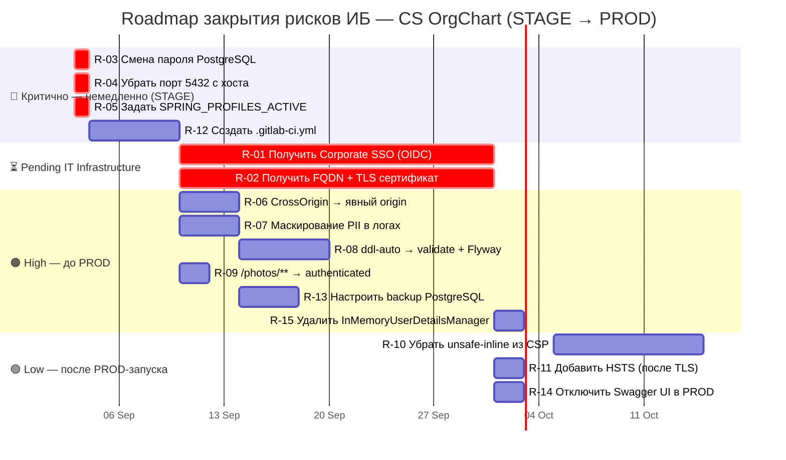
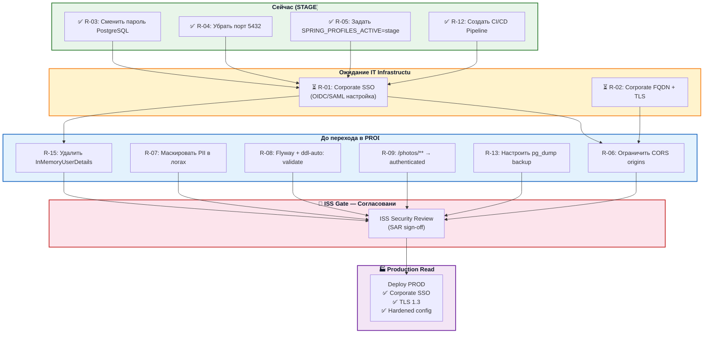
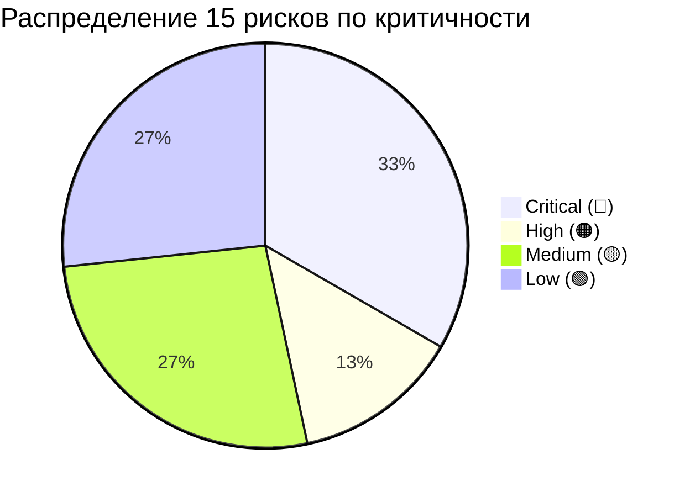
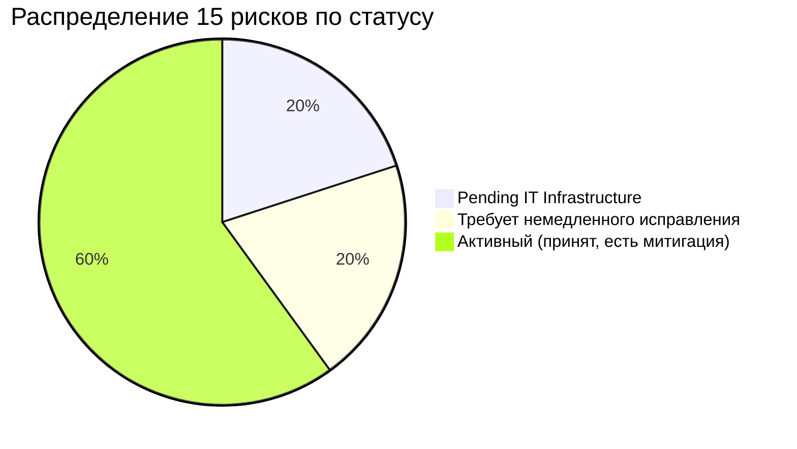

# Этап 4: Реестр рисков и план перехода в Production

> **Документ:** SAR-2026-001 · Часть 4/4
> **Проект:** CS OrgChart / OrgStructure · STAGE
> **Дата:** 2026-09-03
> **Ответственный за реестр:** Security Architect / ISS

---

## 4.1 Полный реестр выявленных рисков

### 4.1.1 Легенда

| Критичность | Обозначение | CVSS-эквивалент | Срок устранения |
|---|---|---|---|
| **Critical** | 🔴 | 9.0–10.0 | Немедленно (до деплоя STAGE) |
| **High** | 🟠 | 7.0–8.9 | До перехода в PROD |
| **Medium** | 🟡 | 4.0–6.9 | До перехода в PROD |
| **Low** | 🟢 | 0.1–3.9 | После PROD-запуска |

| Статус | Обозначение | Описание |
|---|---|---|
| ⏳ Pending IT Infra | Заблокирован внешним блокером — IT Infrastructure | |
| 🔴 Требует немедленного исправления | Разработка / DevOps | |
| 🟡 Активный риск | Принят, есть компенсирующая мера | |
| ✅ Закрыт | Устранён | |

---

### 4.1.2 Реестр рисков — 15 записей

#### Блок I: Внешние блокеры (Pending IT Infrastructure)

| ID | Компонент / Файл | Описание проблемы | Критичность | Статус | Ответственный |
|---|---|---|---|---|---|
| **R-01** | `SecurityConfig.java:66-68` `application.yaml:26-34` | **Отсутствие Corporate SSO (OIDC/SAML).** OAuth2 Client зарегистрирован с провайдером `corporate-sso`, однако `SSO_ISSUER_URI`, `SSO_CLIENT_ID`, `SSO_CLIENT_SECRET` не заданы в `docker-compose.yml`. На STAGE аутентификация пользователей не функционирует как ожидается: при активном профиле `local` — авторизация полностью отключена; при профиле `stage` без SSO-URI — OAuth2 discovery завершается ошибкой. | 🔴 **Critical** | ⏳ Pending IT Infrastructure | IT Infrastructure + Development |
| **R-02** | `docker-compose.yml:19-20` `application.yaml:41-42` | **Отсутствие TLS / корпоративного FQDN.** Приложение доступно по `http://host:8082` без шифрования. `cookie.secure=false` (строка 42 `application.yaml`). Все данные, включая session cookie и персональные данные сотрудников, передаются в открытом виде. HSTS не настроен. | 🔴 **Critical** | ⏳ Pending IT Infrastructure | IT Infrastructure |

---

#### Блок II: Критические риски — требуют немедленного исправления

| ID | Компонент / Файл | Описание проблемы | Критичность | Статус | Ответственный |
|---|---|---|---|---|---|
| **R-03** | `docker-compose.yml:11` `docker-compose.yml:30` | **Пароль PostgreSQL в открытом виде в репозитории.** Строки `POSTGRES_PASSWORD=postgres` и `SPRING_DATASOURCE_PASSWORD=postgres` хранятся в `docker-compose.yml` в plain text. Использование стандартного пароля `postgres` критически опасно. Файл может попасть в историю git или быть виден всем участникам репозитория. Gitleaks обнаружит этот секрет при первом сканировании. | 🔴 **Critical** | 🔴 Требует немедленного исправления | DevOps / Development |
| **R-04** | `docker-compose.yml:7` | **Порт PostgreSQL 5432 открыт на Docker-хосте.** Директива `"5432:5432"` пробрасывает PostgreSQL на сетевой интерфейс хоста. Любой хост в сети, включая потенциального нарушителя в тестовом контуре, может попробовать подключиться к БД напрямую, используя стандартные credentials из R-03. | 🔴 **Critical** | 🔴 Требует немедленного исправления | DevOps |
| **R-05** | `application.yaml:3` | **`spring.profiles.active: local` по умолчанию.** При деплое Docker-образа без явного указания `SPRING_PROFILES_ACTIVE` активируется профиль `local`, который: (1) отключает OAuth2, (2) выполняет `anyRequest().permitAll()`, (3) отключает CSRF, (4) использует `ssl=false` для JDBC, (5) активирует `{noop}` пароли. Это означает, что Docker STAGE без дополнительных ENV-переменных работает без какой-либо защиты. | 🔴 **Critical** | 🔴 Требует немедленного исправления | Development / DevOps |
| **R-15** | `SecurityConfig.java:77-85` | **`InMemoryUserDetailsManager` с `{noop}` паролями.** Учётные записи `user/password` и `admin/password` с паролями в формате `{noop}` (без хэширования) активны при профиле `local`. `{noop}` означает, что пароль хранится и сравнивается в открытом виде — нарушение базовых требований хранения credentials. Не может использоваться в PROD. | 🔴 **High** | 🟡 Только в профиле local (временная мера до SSO) | Development |

---

#### Блок III: Высокие риски (High)

| ID | Компонент / Файл | Описание проблемы | Критичность | Статус | Ответственный |
|---|---|---|---|---|---|
| **R-06** | `EmployeeController.java:16` `LikeController.java:17` `EmployeeInteractionController.java:15` `PageVisitController.java:15` `SearchLogController.java:15` | **`@CrossOrigin(origins = "*")` во всех 5 REST-контроллерах.** Wildcard CORS разрешает cross-origin запросы с любого домена. Это открывает возможности для CSRF-подобных атак (при слабой защите) и утечки данных сотрудников через вредоносные страницы. Затронуты эндпоинты: `/api/employees`, `/api/search`, `/api/likes`, `/api/interactions`, `/api/page-visits`, `/api/search-logs`. | 🟠 **High** | 🟡 Принят на STAGE (закрытый контур) | Development |
| **R-12** | Репозиторий (отсутствие `.gitlab-ci.yml`) | **Отсутствует GitLab CI/CD Pipeline.** В репозитории не существует файла `.gitlab-ci.yml`. Код деплоится вручную без автоматических Security Gates: SAST, SCA, Secret Detection, Image Scan. Любая новая уязвимость или случайно закоммиченный секрет не будет обнаружен до ручной проверки. | 🟠 **High** | 🟡 Активный | Development / DevOps |

---

#### Блок IV: Средние риски (Medium)

| ID | Компонент / Файл | Описание проблемы | Критичность | Статус | Ответственный |
|---|---|---|---|---|---|
| **R-07** | `EmployeeController.java:31` `LikeController.java:31` | **PII в логах (email, поисковый запрос).** `log.info("GET /api/search?q={}", q)` записывает поисковый запрос (может содержать ФИО) в STDOUT. `log.info("POST /api/likes email={} ...", email, ...)` записывает e-mail сотрудника. Логи доступны через `docker logs` без аутентификации для лиц, имеющих доступ к Docker Host. | 🟡 **Medium** | 🟡 Активный | Development |
| **R-08** | `application.yaml:16` | **`ddl-auto: update` в конфигурации.** Hibernate DDL-auto `update` разрешает автоматическое изменение схемы БД при каждом запуске приложения. На STAGE это допустимо, но в PROD может привести к непредвиденным ALTER TABLE операциям. Отсутствует система миграций (Flyway/Liquibase). | 🟡 **Medium** | 🟡 Активный (допустимо на STAGE) | Development |
| **R-09** | `SecurityConfig.java:58` | **`/photos/**` доступен без аутентификации.** Маршрут `/photos/**` явно разрешён без аутентификации (`permitAll()`). Фотографии сотрудников — биометрические персональные данные (GDPR Art.9). URL фотографий предсказуемы: `/photos/{email}.jpg` или `/photos/{username}.jpg`. Возможно перечисление фотографий всех сотрудников без авторизации. | 🟡 **Medium** | 🟡 Принят на STAGE (закрытый контур) | Development |
| **R-13** | `docker-compose.yml` | **Отсутствует резервное копирование БД.** В конфигурации не определена стратегия backup для PostgreSQL. В случае сбоя или повреждения тома `./pgdata` данные (employee_likes, employee_interactions, search_logs, page_visits) будут утеряны без возможности восстановления. | 🟡 **Medium** | 🟡 Активный | DevOps |

---

#### Блок V: Низкие риски (Low)

| ID | Компонент / Файл | Описание проблемы | Критичность | Статус | Ответственный |
|---|---|---|---|---|---|
| **R-10** | `SecurityConfig.java:41` | **`Content-Security-Policy: unsafe-inline`.** CSP содержит директивы `'unsafe-inline'` для `script-src` и `style-src`. Это снижает защиту от XSS-атак, допуская выполнение inline-скриптов. На текущий момент Frontend использует Vanilla JS в отдельных файлах, но inline-стили могут присутствовать в HTML. | 🟢 **Low** | 🟡 Активный | Development |
| **R-11** | `SecurityConfig.java` (отсутствует HSTS) | **HSTS не настроен.** Заголовок `Strict-Transport-Security` отсутствует. Риск заблокирован до подключения TLS (R-02), поскольку HSTS имеет смысл только при HTTPS. После подключения TLS — обязательно к настройке. | 🟢 **Low** | ⏳ Заблокирован R-02 | Development |
| **R-14** | `pom.xml:96` `springdoc-openapi-starter-webmvc-ui:2.5.0` | **Swagger UI доступен в не-local окружении.** SpringDoc OpenAPI подключён как зависимость без явного ограничения по профилям. В STAGE/PROD доступна `/swagger-ui.html` и `/v3/api-docs` — полная документация всех API-эндпоинтов, включая `/api/admin/**`. Это упрощает разведку для потенциального нарушителя. | 🟢 **Low** | 🟡 Принят на STAGE | Development |

---

## 4.2 Компенсирующие меры безопасности на STAGE

Следующие меры применяются на период ожидания инфраструктурных компонентов (SSO, TLS).

| Риск | Компенсирующая мера | Ответственный | Срок |
|---|---|---|---|
| **R-01** (SSO) | Ограничить сетевой доступ к STAGE исключительно корпоративной сетью / VPN. Вести реестр лиц, получивших доступ к STAGE вручную. | DevOps / IT Infrastructure | Немедленно |
| **R-02** (TLS) | STAGE доступен только в закрытом тестовом сетевом контуре без выхода в интернет. Документировать отсутствие TLS в SAR явно. | IT Infrastructure | Немедленно |
| **R-03** (пароль) | Сменить `POSTGRES_PASSWORD` на случайный пароль ≥ 32 символов. Хранить в `.env`-файле **вне** репозитория или в GitLab CI/CD Variables (Masked). | DevOps | **Сегодня** |
| **R-04** (порт 5432) | Убрать `ports: "5432:5432"` из `docker-compose.yml`. Настроить firewall-правило на хосте: DROP для входящих соединений на порт 5432. | DevOps | **Сегодня** |
| **R-05** (профиль) | Добавить `SPRING_PROFILES_ACTIVE=stage` в `docker-compose.yml`. Удалить строку `active: local` из `application.yaml` или переопределить ENV. | Development | **Сегодня** |
| **R-06** (CORS) | На STAGE закрытый контур митигирует риск. Задокументировать. Запланировать исправление на ближайший спринт. | Development | До PROD |
| **R-07** (PII в логах) | Поднять уровень логирования с DEBUG на INFO для `cs_orgchart`. Ограничить доступ к `docker logs` только DevOps. | Development / DevOps | Неделя |
| **R-12** (CI/CD) | Ручной чеклист перед каждым деплоем на STAGE: ревью кода, запуск `mvn dependency-check`. | Development | До создания pipeline |

---

## 4.3 Gantt-roadmap: закрытие долгов ИБ

---

## 4.4 Критический путь к Production

---

## 4.5 Сводный дашборд рисков

---

## 4.6 Условия закрытия SAR и разрешение на PROD

Переход проекта CS OrgChart из STAGE в Production **разрешается только** после выполнения следующих условий и подписания матрицы согласования в [README.md](README.md):

| # | Условие | Критерий выполнения | Верификатор |
|---|---|---|---|
| 1 | R-01: SSO подключён | OAuth2 login работает, AD-группы маппируются на роли Spring | ISS + Lead Dev |
| 2 | R-02: TLS активен | HTTPS 200 OK, `cookie.secure=true`, HSTS заголовок присутствует | ISS + DevOps |
| 3 | R-03: Пароль PostgreSQL изменён | Новый пароль ≥ 32 символов, хранится в Secret Manager | DevOps |
| 4 | R-04: Порт 5432 закрыт | Нет внешней маршрутизации на 5432 с хоста | DevOps |
| 5 | R-05: Профиль явно задан | `SPRING_PROFILES_ACTIVE` ≠ `local` в production ENV | Lead Dev |
| 6 | R-06: CORS ограничен | `@CrossOrigin` указывает на корпоративный FQDN | Lead Dev |
| 7 | R-09: `/photos/**` защищён | Эндпоинт требует аутентификации | Lead Dev |
| 8 | R-12: CI/CD активен | Pipeline проходит все Security Gates | DevOps |
| 9 | R-15: InMemory удалён | Класс `InMemoryUserDetailsManager` удалён из кода | Lead Dev |
| 10 | SAR подписан | Все подписи в матрице согласования [README.md](README.md) получены | ISS / CISO |

---

*← [03_infrastructure_and_devsecops.md](03_infrastructure_and_devsecops.md) | [README.md](README.md)*

*SAR-2026-001 · Часть 4/4 · CS OrgChart · STAGE · 2026-09-03*
