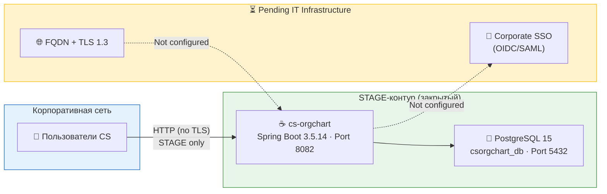

# Security Architecture Review — CS OrgChart (OrgStructure)

> **Документ:** SAR-2026-001
> **Проект:** CS OrgChart / OrgStructure
> **Репозиторий:** `sseytbekov14/OrgStructure`
> **Текущий этап:** STAGE
> **Дата составления:** 2026-09-03
> **Версия документа:** 1.0
> **Статус:** На согласовании ISS

---

## Аннотация

Настоящий комплект документов Security Architecture Review (SAR) подготовлен для проверки отделом информационной безопасности (ISS) перед переводом проекта CS OrgChart в промышленную эксплуатацию (PROD).

Документ составлен на основе **полного анализа исходного кода репозитория** — структуры каталогов, `pom.xml`, `docker-compose.yml`, `Dockerfile`, `application.yaml`, `application-local.yaml`, `SecurityConfig.java`, `WebMvcConfig.java`, всех 6 REST-контроллеров, 7 сервисов и 6 JPA-сущностей.

**CS OrgChart** — интерактивная оргструктура Central Services для быстрого поиска сотрудников, функций и контактов. Система обрабатывает персональные данные сотрудников, загружаемые из Excel-файла, и хранит поведенческую аналитику (лайки, просмотры, поиск) в базе данных PostgreSQL.

### Ключевые ограничения текущего этапа STAGE

| Компонент | Статус | Ответственный |
|---|---|---|
| **Corporate SSO (SAML/OIDC)** | ⏳ Pending — ожидается от IT Infrastructure | IT Infrastructure |
| **Corporate FQDN + SSL/TLS** | ⏳ Pending — ожидается от IT Infrastructure | IT Infrastructure |
| **GitLab CI/CD Pipeline** | ⏳ Требует создания `.gitlab-ci.yml` | Development Team |

---

## Состав комплекта SAR

| № | Документ | Содержание |
|---|---|---|
| — | **[README.md](README.md)** *(этот файл)* | Индекс, метаданные проекта, матрица согласования |
| 1 | **[01_architecture_and_dataflow.md](01_architecture_and_dataflow.md)** | Архитектурная топология C4, технический стек, Data Flow, классификация данных |
| 2 | **[02_application_security_and_code.md](02_application_security_and_code.md)** | Аудит кода, RBAC-матрица, анализ уязвимостей, политика DevSecOps-сканирования |
| 3 | **[03_infrastructure_and_devsecops.md](03_infrastructure_and_devsecops.md)** | Аудит Docker/инфраструктуры, шифрование, CI/CD pipeline, мониторинг и логирование |
| 4 | **[04_risk_assessment_and_roadmap.md](04_risk_assessment_and_roadmap.md)** | Реестр 15 рисков, компенсирующие меры, Gantt-roadmap до Production |

---

## Обзор архитектуры (краткая схема)

---

## Сводная таблица критических рисков

| ID | Риск | Критичность | Статус |
|---|---|---|---|
| R-01 | Отсутствие Corporate SSO | 🔴 Critical | Pending IT Infra |
| R-02 | Отсутствие TLS (plain HTTP) | 🔴 Critical | Pending IT Infra |
| R-03 | Пароль PostgreSQL в открытом виде (`postgres`) | 🔴 Critical | Требует исправления |
| R-04 | Порт PostgreSQL 5432 открыт на хосте | 🔴 High | Требует исправления |
| R-05 | `spring.profiles.active: local` по умолчанию | 🟠 High | Требует исправления |
| R-06 | `@CrossOrigin(origins = "*")` во всех контроллерах | 🟠 Medium | Активный |

*Полный реестр 15 рисков: [04_risk_assessment_and_roadmap.md](04_risk_assessment_and_roadmap.md)*

---

## Матрица согласования (Sign-off Sheet)

> Подпись в данной таблице подтверждает ознакомление с содержанием документа SAR-2026-001 и принятие/отклонение архитектурных решений в соответствии с корпоративной политикой ИБ.

| Роль | ФИО | Подразделение | Решение | Подпись | Дата |
|---|---|---|---|---|---|
| **Security Architect** (автор SAR) | | ISS / Architecture | ✍️ Составил | | |
| **Lead Developer / Tech Lead** | | Development | ☐ Согласован / ☐ Возражения | | |
| **DevOps Engineer** | | IT Operations | ☐ Согласован / ☐ Возражения | | |
| **Head of IT Infrastructure** | | IT Infrastructure | ☐ Согласован / ☐ Возражения | | |
| **ISS Reviewer** | | Information Security | ☐ Согласован / ☐ Условно / ☐ Отклонён | | |
| **CISO / IT Security Manager** | | Information Security | ☐ Утверждён / ☐ Отклонён | | |

### Условия выдачи разрешения на переход в Production

Переход проекта CS OrgChart из STAGE в PROD разрешается **только при выполнении всех следующих условий:**

- [ ] R-01: Corporate SSO (OIDC/SAML) подключён и протестирован
- [ ] R-02: Корпоративный FQDN выделен, TLS 1.3 сертификат установлен
- [ ] R-03: Пароль PostgreSQL изменён, управляется через Secret Manager
- [ ] R-04: Порт 5432 убран из внешнего маппинга
- [ ] R-05: Профиль `local` не активен в production-конфигурации
- [ ] R-06: `@CrossOrigin` ограничен корпоративным origin
- [ ] R-12: GitLab CI/CD pipeline создан и проходит все Security Gates

---

*Версия: 1.0 · SAR-2026-001 · CS OrgChart · STAGE*
*Следующий пересмотр: при подключении SSO и TLS (milestone PROD-ready)*
